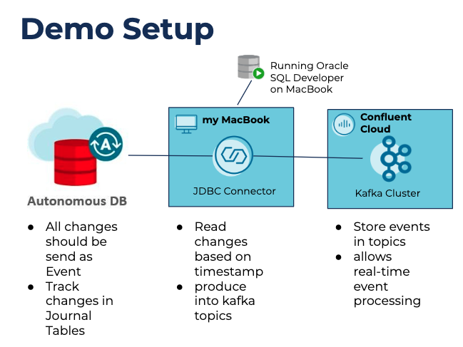

# Confluent Kafka cluster with CDC Oracle DB Source Connector w/o Goldengate
How you can create a CDC solution with Oracle database as source and Confluent Kafka cluster without Goldengate is answered by this demo case. MS SQL Server CDC is based mainly on Journal tables. 
Goldengate is doing change data capturing from REDOLOGs, this is very fast, but also expensive, because you need Oracle Goldengate.
But one can also doing CDC with Oracle DB the MS-SQL-Server-CDC-way. Just create Journal Tables for your application data model, track all the changes automatically and produce changes from journal tables to Confluent kafka cluster. The implementation of such a CDC solution is very easy. Just reverse engineer your application data model into Oracle SQL Developer data modeler and generate Journal tables by clicking Generate DDL in SQL Developer.
Journal tables will be implement into your existing application data model and capturing via trigger concept all changes into Journal tables.

This demo showcase create a autonomous ATP database in Oracle Cloud Infrastucture (OCI), create a Confluent Cloud (CC) kafka cluster, install a demo data model into ATP database via SQL Developer, create a Journal Table concept on top of it and start a Confluent JCDB Source Connector to produce all changes from customer table into Confluent Cloud cluster.

Setuzp of this environment and execution is about 15 minutes (without installation time). I use the free tier ATP database and the CC standard free tier. The connector is running from my macbook. ( there are no costs expected). 

I did prepare two ways to execute the demo
* [manual](manual/README.md) setup
* [automatic](automatic/README.md)setup (coming soon)

As I said, to make the setup very easy, I decided to use
* the freetier autonomous ATP database in Oracle Cloud Infrastructure (OCI)
* a fully managed Kafka cluster in Confluent Cloud

The setup looks like this

