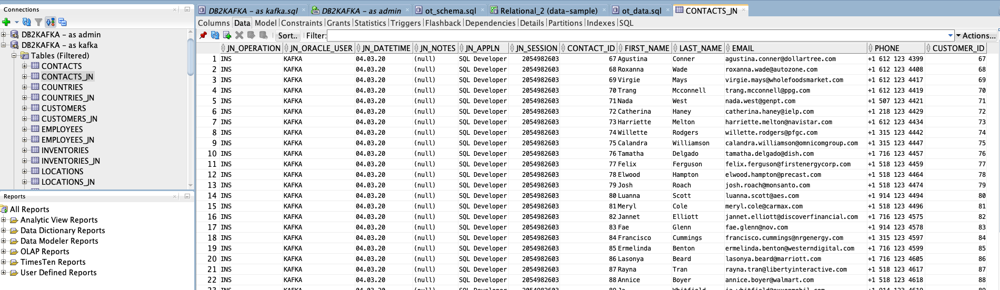

# Oracle CDC into Confluent Kafka manual Setup
This setup is a step-by-step guide how to setup a CDC Connector for Oracle database and produce into Confluent Kafka via journal tables.

## Prerequisites
* java 8 or java 11 should run on your machine
* Confluent Platform 5.4 installed on your machine (in my case Macbook). [Download Confluent Platform](https://www.confluent.io/download)
* Confluent Cloud Standard Kafka cluster running. [Create your Confluent Cloud cluster for free](https://www.confluent.io/confluent-cloud/)
* Oracle SQL Developer: [Download](https://www.oracle.com/tools/downloads/sqldev-v192-downloads.html) Oracle SQL Developer and unzip on your environment.
* Oracle Database: Create Oracle Autonomous free tier Instance in [Oracle Cloud Infrastructure](https://console.eu-frankfurt-1.oraclecloud.com/db/atp/)create. The provisioning will take a couple of minutes. See [tutorial](https://docs.oracle.com/en/cloud/paas/autonomous-data-warehouse-cloud/tutorial-getting-started-autonomous-db/index.html)
* If the Autonomous Database is up and running, download the credential-wallet-zip-archiv from OCI console (via Connect tab).


Now ATP is running and we can do a connection from our local machine where SQL Developer is installed

## Connect SQL Developer with autonomous database
During the creation process of ATP database you have to enter a password for the admin user.
The credential wallet from ATP created autonomous database is donwloaded. Unzip/uncompress the credentials file into a secure folder on your client computer. Edit edit sqlnet.ora and set correct directory for wallet e.g. /yourpath/Demos/oracle/oracle_credentials_wallet
```bash
export TNS_ADMIN=/yourpath/Demos/oracle/oracle_credentials_wallet
```
Create a new connection in SQL Developer wit admin user and the download wallet. You have three database services in your tnsnames.ora in wallet (if you unzip, you can check). For the admin user connection to ATP we ill use th high db service (get full resource), later we will use the low db service for the connector, so that the main power of the DB is for the DB and not the connector.


## Setup Demo database schema with data model and data  
If your connection if up and running install the user:
```bash
Create user kafka identified by yourpassword;
grant RESOURCE to kafka;
grant create session to kafka;
alter user kafka quota 50m on data;
```
or run [01_create_user.sql](01_create_user.sql) script in SQL Developer directly.
Now, log in as the new created kafka user in ATP and execute the following script to install our demo data model
```bash
@your-path/confluent-kafka-oracledb-cdc-light/manual/02_create_schema_datamodel.sql
```
or open [Create-User-Script](01_create_user.sql) directly with SQL Developer and execute Script (click F5 button).
Now, the application data model is installed.
I did prepare the journal tables already, so you can install it very easily per script in SQL Developer:
```bash
@your-path/confluent-kafka-oracledb-cdc-light/manual/03_create_journal_tables_datasample.ddl
```
But if you want to do you own reverse engineering in Data modeler and script the journal tables by yourself, please follow this following step-by-stpe guide

### Generate Journal tables
Open in SQL Developer under View Data Modeler Brower and import Kafka Schema Objects (File->Data Modeler->Import->Data Dictionary). 


Data Modeler Relation Models will be updated. And we have our data model in data modeler.


In the relational view click on Generate DDL button, choose the connection and click generate, switch to include Table DDL script. Set Active Script set to Journal Tables. Check each table of Kafka schema and click on OK


The complete DDL script including normal tables is now visible. Save script and Drop everything what is not related to journal tables (only Table *_JN and Triggers *_JNtrg stay). Install Journal tables with SQL Developer.


CDC in Oracle database is configured. All changes will be tracked via Trigger concept into corresponding journal tables. If the application will change something in table employees the change is stored in table employees_jn.



## Configure and Start CDC Source Connector
After setup cdc in ATP database, we have to prepare our CDC Source Connector. Confluent Platform is already installed.
```bash
export wallet_unzipped_folder=/yourpath/Demos/oracle/oracle_credentials_wallet
mkdir -p $wallet_unzipped_folder
unzip -u Wallet_DB2KAFKA.zip -d $wallet_unzipped_folder
sed -i -E 's|DIRECTORY=".*"|DIRECTORY="/yourpath/Demos/oracle/oracle_credentials_wallet"|g'  $wallet_unzipped_folder/sqlnet.ora
export TNS_ADMIN=/yourpath/Demos/oracle/oracle_credentials_wallet
```
If JDBC driver is not installed please do it:
```bash
# Configure JDBC (my confluent stuff is installed under /software/confluent)
cd /software/confluent/share/java/kafka-connect-jdbc
wget https://objectstorage.us-phoenix-1.oraclecloud.com/n/intmahesht/b/oracledrivers/o/ojdbc8-full.tar.gz
tar xvzf ./ojdbc8-full.tar.gz
cp ojdbc8-full/*.jar  ./
chmod 644 *.jar
rm -rf ojdbc8-full
rm -rf ojdbc8-full.tar.gz
```
Now, create your [connect properties](connect-avro_distributed.properties) file and [connector json file](dbsource-atp.json) for the CDC Source Connector
A general property file for your Confluent Cloud cluster is here: [ccbroker.properties](ccbroker.properties), please change.
And Start the Connector:
```bash
# Terminal 1: Start Connect Worker
cd /yourpath/Demos/oracle
connect-distributed connect-avro_distributed.properties
# Terminal 2
# check connect worker
curl localhost:8083/ | jq
# connector plugins
curl localhost:8083/connector-plugins | jq
# create topic first, because CCloud do mot offer autocreate topic
kafka-topics --bootstrap-server CCBROKER:9092 --create --topic ora-atp-CUSTOMERS_JN --command-config ccbroker.properties --partitions 6 --replication-factor 3

# Run JDBC Source Connector
curl -X POST -d @dbsource-atp.json  http://localhost:8083/connectors --header "content-Type:application/json"

# Running connectors
curl localhost:8083/connectors

# Status Replicator Connector
curl localhost:8083/connectors/dbsource-atp/status | jq

# If you want Delete connectors
curl -X DELETE localhost:8083/connectors/dbsource-atp
```

## Load data and consume CDC data in Confluent Cloud kafka cluster
Now, load data, open File [04_load_data.sql](04_load_data.sql) with kafka db-user and execute the script in SQL Developer.
```BASH
@@your-path/confluent-kafka-oracledb-cdc-light/manual/04_load_data.sql
```
In parallel start a consumer and check what is coming to confluent cloud kafka cluster:
```BASH
kafka-avro-console-consumer --bootstrap-server CCBROKER:9092 --topic ora-atp-CUSTOMERS_JN \
 --consumer.config ccbroker.properties \
 --property basic.auth.credentials.source=USER_INFO \
 --property schema.registry.url=https://CCSRURL \
 --property schema.registry.basic.auth.user.info=CCSRAPIKEY:CCSRSECRET
```
You will see all the changes coming into the kafka cluster. Additionally you can do updates, deletes in DB customers table and see all changes coming to the kafka cluster.
## Next steps
Do your event streams processing in kafka cluster.

